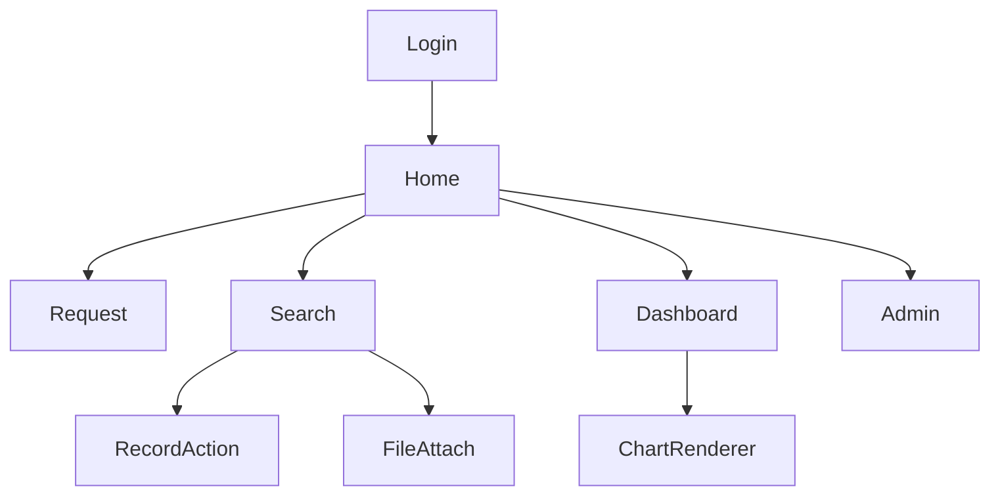

# Request Management & Tracking System

**Description**: This is a modern Single Page Application (SPA) developed using Vue.js and Laravel, with a MySQL database, designed to streamline and optimize the management and tracking of requests within your organization.

## Features

### Authentication System with LDAP Integration
- Our system offers a secure authentication process, seamlessly integrating with your company's internal LDAP (Lightweight Directory Access Protocol). This ensures that access is restricted to authorized personnel only.

### Request Submission Form
- The application provides a user-friendly form for inputting request details. It supports file attachments and automatically generates unique request numbers, simplifying the request submission process.

### Advanced Search Functionality
- Effortlessly locate specific request records using a versatile search form. Users can filter results by request number, case status, or request date. The results are presented in a tabular format, complete with detailed attributes for each record, and an accurate count of results found.

### Bulk Record Management
- Users can efficiently manage multiple records at once by selecting and setting their case statuses. The system allows for marking cases as 'on-going' or 'complete,' enhancing the overall workflow efficiency.

### Request Details View
- For comprehensive information on specific requests, the search form seamlessly links to a dedicated page for individual request records, ensuring users have access to all relevant details.

### Dashboard with Request Overview
- The dashboard provides a high-level overview of all requests, presented in an organized tabular format. Additionally, a section dedicated to case status counters offers real-time insights into the distribution of cases within the system.

### Data Export Capabilities
- The dashboard facilitates data export, allowing users to extract data into CSV (Comma-Separated Values) format for further analysis or reporting purposes.

### Summary Charts
- Utilizing the power of Chart.js, the system features a Summary Charts page, offering in-depth visual statistics on the quantity of damaged product parts submitted. Various chart types, including bar charts, pie charts, and line charts, display data on a weekly and monthly basis, ensuring comprehensive insights into the data.

This comprehensive and secure system empowers organizations with enhanced request management and tracking capabilities, facilitating efficient data analysis and reporting for better decision-making.

# Technologies Used

## Frontend

   

- **Vue.js**: Our frontend is built using Vue.js, a progressive JavaScript framework. It comprises several components and pages tailored to support each functionality of the system, providing a responsive and intuitive user interface.

- **Vue Router**: To facilitate frontend page navigation and create a seamless user experience, we employ Vue Router, a powerful routing library for Vue.js.

- **Vuex**: For effective and organized variable state management within the frontend, we utilize Vuex. This ensures that our application maintains a clean and predictable state, making it easier to manage data and interactions.

- **Chart.js**: Empowering our project with dynamic and interactive summary charts, Chart.js transforms data into visually engaging bar, pie, and line charts, facilitating easy data interpretation and decision-making.

## Backend

 

- **Laravel**: The backend logic and controllers of our system are developed using Laravel, a PHP web application framework known for its elegant syntax and comprehensive toolkit. Laravel simplifies tasks like routing, authentication, and database interactions.

- **MySQL Database**: To store and manage request data, we leverage the MySQL database system. MySQL is renowned for its reliability, performance, and scalability, making it an excellent choice for data storage and retrieval.

This technology stack ensures a robust and efficient system, combining the best of frontend and backend tools to deliver a seamless experience for users.

# Application Designs

### Component Diagram

# License

This project is the proprietary code of Seagate Technology LLC. and is not open-source. Only README.md is provided here solely for the purpose of showcasing developer skills and project capabilities. Unauthorized use, reproduction, or distribution of this code is prohibited.

**© 2023 Seagate Technology LLC. All rights reserved.**
